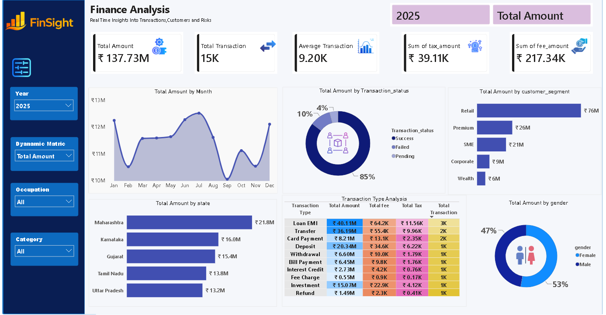

# PowerBI-Finance-Analysis--Dashboard
Interactive Power BI Dashboard for financial analysis using DAX,KPI Cards,Dynamic Matrics,slicers and Drill-Through.

## Features
- KPI Cards
- Dynamic Matric Selection
- SAMEPERIODLASTYEAR()
- SWITCH()
- Slicers
- Drill-through for Transaction Details

## KEY INSIGHTS
- Retail was the top performing customer segment.
- Maharashtra generated the highest sales.
- 85% of transaction was successful

## Author
- KUMAR AMRIT
